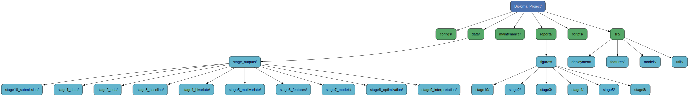
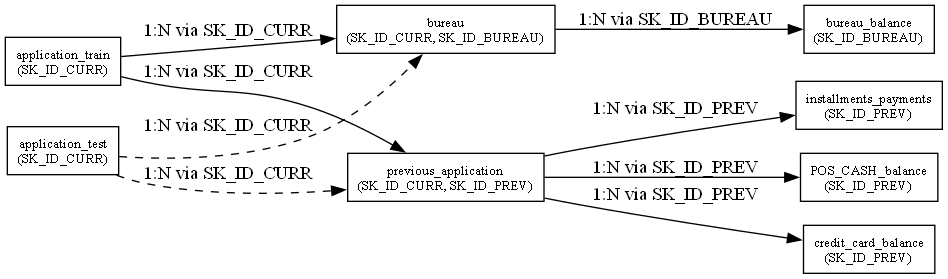

# Дипломный проект: Home Credit Default Risk

## Общее описание проекта
Этот проект выполнен в рамках дипломной работы курса Data Science от SkillFactory и посвящён решению задачи кредитного скоринга на основе данных соревнования **Home Credit Default Risk (Kaggle)**.

**Цель проекта** — построить надёжную, интерпретируемую и воспроизводимую модель машинного обучения, способную предсказывать вероятность возникновения у заёмщика проблем с погашением кредита.

Проект охватывает все **10 этапов DS‑разработки**, включая анализ данных, очистку, генерацию признаков, построение моделей, интерпретацию и создание продакшен‑пайплайна.

---

## Цели и результаты

В ходе проекта были выполнены все этапы полного ML‑цикла и достигнуты следующие результаты:

- Проведён глубокий EDA по 10 связанным таблицам с миллионами строк  
- Построена многоуровневая система очистки данных  
- Реализована масштабная генерация признаков (агрегации, доменные признаки, статистические признаки)  
- Построены и сравнены десятки моделей: Logistic Regression, Random Forest, XGBoost, CatBoost, LightGBM  
- Проведён подбор гиперпараметров (Optuna)  
- Реализован **stacking‑ансамбль**  
- Выполнена интерпретация модели (SHAP, permutation importance)  
- Создан полноценный продакшен‑пайплайн в `src/deployment/`:
  - загрузка данных  
  - обработка пропусков  
  - кодирование  
  - масштабирование  
  - генерация признаков  
  - загрузка модели  
  - предсказание  
- Подготовлены визуализации для защиты  
- Обеспечена полная воспроизводимость (requirements, environment, фиксированные сиды)

---

## Бизнес‑контекст

Финансовые организации ежедневно принимают решения о выдаче кредитов. Ошибки в оценке риска приводят к:

- потерям  
- ухудшению качества портфеля  
- снижению прибыли  

Модель кредитного скоринга позволяет:

- уменьшить долю дефолтов  
- повысить точность одобрения заявок  
- автоматизировать процесс принятия решений  
- поддерживать риск‑ориентированное ценообразование  

**Целевая переменная:**

- `1` — клиент с высокой вероятностью дефолта  
- `0` — надёжный клиент  

---

## Структура проекта

Diploma_Project/
│
├── src/
│   ├── deployment/                     ← Stage 10: финальный продакшен‑пайплайн
│   │   ├── __init__.py
│   │   ├── config_loader.py
│   │   ├── data_loader.py
│   │   ├── encoding.py
│   │   ├── missing.py
│   │   ├── scaling.py
│   │   ├── fe_v1.py
│   │   ├── fe_v2.py
│   │   ├── fe_v3.py
│   │   ├── model_loader.py
│   │   ├── prediction.py
│   │   └── utils.py
│   │
│   ├── features/                       ← Stage 5–6: генерация признаков
│   │   └── feature_engineering.py
│   │
│   ├── models/                         ← Stage 7–8: обучение моделей
│   │   └── trainers.py
│   │
│   └── utils/                          ← Общие утилиты
│       └── schema_driven_preprocessing.py
│
├── scripts/
│   └── check_feature_consistency.py    ← Валидация признаков
│
├── reports/
│   └── figures/
│       ├── stage2/
│       ├── stage3/
│       ├── stage4/
│       ├── stage5/
│       ├── stage8/
│       └── stage10/
│
├── configs/
│   └── *.json / *.yml                  ← Конфигурации пайплайна
│
├── maintenance/
│   ├── plots.ps1
│   └── archive_stage10_relics.ps1
│
├── requirements.txt
├── environment.yml
├── README.md
└── diploma_project.ipynb

│

---

## Описание данных
Проект использует **10 CSV‑файлов** из соревнования Kaggle, включая:

| Таблица | Строк | Столбцов | Описание |
|--------|-------|----------|----------|
| `application_train` | 307 511 | 122 | Основная таблица с целевой переменной |
| `application_test` | 48 744 | 121 | Тестовая выборка без TARGET |
| `bureau` | 1 716 428 | 17 | Кредиты клиента в сторонних бюро |
| `bureau_balance` | 27 299 925 | 3 | Помесячная история кредитов из bureau |
| `previous_application` | 1 670 214 | 37 | История предыдущих кредитных заявок |
| `POS_CASH_balance` | 10 001 358 | 8 | История POS‑кредитов |
| `credit_card_balance` | 3 840 312 | 23 | История по кредитным картам |
| `installments_payments` | 13 605 401 | 8 | История платежей по кредитам |
| `HomeCredit_columns_description` | 219 | 4 | Описание всех признаков |
| `sample_submission` | 48 744 | 2 | Формат отправки на Kaggle |

## Схема связей между таблицами

Данные включают **миллионы строк** в дополнительных таблицах и требуют масштабной агрегации и инженерии признаков.
---

## Данные

Используются 10 таблиц из соревнования Kaggle:

- `application_train` / `application_test`
- `bureau` / `bureau_balance`
- `previous_application`
- `POS_CASH_balance`
- `credit_card_balance`
- `installments_payments`

Общий объём данных — **более 40 млн строк**.

---

## Основные этапы проекта (строго по Stage 1–10)

### **Stage 1 — Анализ структуры данных**
- изучение всех таблиц  
- определение ключей (`SK_ID_CURR`, `SK_ID_PREV`, `SK_ID_BUREAU`)  
- построение схемы связей  
- поиск потенциальных утечек  

### **Stage 2 — EDA**
- анализ распределений  
- корреляционный анализ  
- сравнение TARGET=0/1  
- статистические тесты (t‑test, U‑test, χ², KS‑test, ANOVA)  
- сохранение визуализаций  

### **Stage 3 — Очистка данных**
- обработка пропусков  
- исправление категориальных значений  
- удаление невозможных значений  
- обработка аномалий  
- нормализация типов данных  

### **Stage 4 — Бивариантный анализ**
- тепловые карты корреляций  
- анализ категориальных и числовых признаков  
- mutual information  
- оценка значимости признаков  

### **Stage 5 — Многомерный анализ**
- SHAP  
- взаимодействия признаков  
- частичные зависимости  

### **Stage 6 — Генерация признаков**
- агрегации по всем дополнительным таблицам  
- доменные признаки  
- статистические признаки  
- ratio‑признаки  
- объединение в финальную таблицу  

### **Stage 7 — Базовые модели**
- Logistic Regression  
- Decision Tree  
- baseline‑метрики  

### **Stage 8 — Продвинутые модели**
- LightGBM  
- CatBoost  
- XGBoost  
- Random Forest  
- Optuna‑оптимизация  
- Stacking  

### **Stage 9 — Интерпретация**
- SHAP summary  
- SHAP dependence  
- permutation importance  
- бизнес‑интерпретация  

### **Stage 10 — Продакшен‑пайплайн**
Финальный пайплайн реализован в `src/deployment/`:

- загрузка данных  
- обработка пропусков  
- кодирование  
- масштабирование  
- генерация признаков  
- загрузка модели  
- предсказание  

---

## Метрики качества

**Основная метрика:**

- AUC ROC

**Дополнительные:**

- Precision, Recall, F1  
- PR‑AUC  
- KS‑статистика  
- Confusion Matrix  

---

## Интерпретируемость

Использованы:

- SHAP (глобальные и локальные объяснения)  
- Permutation Importance  
- Partial Dependence Plots  

---

## Воспроизводимость

Проект полностью воспроизводим благодаря:

- `requirements.txt`  
- `environment.yml`  
- фиксированным сид‑значениям  
- модульной структуре кода  
- сохранённым конфигурациям  

---

## Просмотр ноутбука

Ноутбук содержит большое количество визуализаций и может не отображаться на GitHub.

### Google Colab  
Открыть в Colab: *(colab.research.google.com)*

### NBViewer  
Открыть в NBViewer: *(nbviewer.org)*

---

## Итоги

В результате проекта была построена надёжная, интерпретируемая и воспроизводимая модель кредитного скоринга, а также создан полный продакшен‑пайплайн, готовый к интеграции в реальную систему принятия решений.
